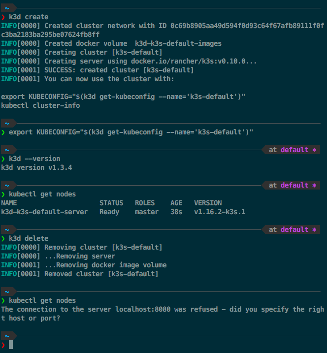

# openfaas-my-workshop
Test the openfaas on my workshop

## Work shop: 1

### Step 1: Install k3d to use kubernetes on macOS

#### Use homebrew to install k3d
```
$ brew install k3d
```
Check version
```
$ k3d --version
```
#### Usage

Check out what you can do via `k3d help`

Example Workflow: Create a new cluster and use it with `kubectl`
(*Note:* `kubectl` is not part of `k3d`, so you have to [install it first if needed](https://kubernetes.io/docs/tasks/tools/install-kubectl/))

1. `k3d create` to create a new single-node cluster (docker container)
2. `export KUBECONFIG="$(k3d get-kubeconfig --name='k3s-default')"` to make `kubectl` to use the kubeconfig for that cluster
3. execute some commands like `kubectl get pods --all-namespaces`
4. `k3d delete` to delete the default cluster




## Expose services

### 1. via Ingress

In this example, we will deploy a simple nginx webserver deployment and make it accessible via Iingress.
Therefore, we have to create the cluster in a way, that the internal port 80 (where the `traefik` ingress controller is listening on) is exposed on the host system.

1. Create a cluster, mapping the ingress port 80 to localhost:8081

    `k3d create --api-port 6550 --publish 8081:80 --workers 2`

    - Note: `--api-port 6550` is not required for the example to work. It's used to have `k3s`'s API-Server listening on port 6550 with that port mapped to the host system.

2. Get the kubeconfig file

    `export KUBECONFIG="$(k3d get-kubeconfig --name='k3s-default')"`

3. Create a nginx deployment

    `kubectl create deployment nginx --image=nginx`

4. Create a ClusterIP service for it

    `kubectl create service clusterip nginx --tcp=80:80`

5. Create an ingress object for it with `kubectl apply -f`
  *Note*: `k3s` deploys [`traefik`](https://github.com/containous/traefik) as the default ingress controller

    ```YAML
    apiVersion: extensions/v1beta1
    kind: Ingress
    metadata:
      name: nginx
      annotations:
        ingress.kubernetes.io/ssl-redirect: "false"
    spec:
      rules:
      - http:
          paths:
          - path: /
            backend:
              serviceName: nginx
              servicePort: 80
    ```

6. Curl it via localhost

    `curl localhost:8081/`
